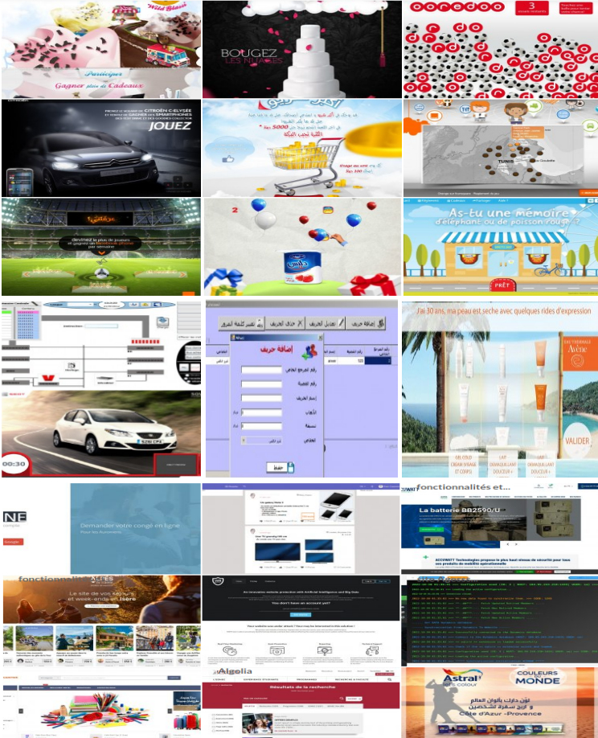

# Anwer Awled Belhedi

Accomplished Full Stack Application Developer with 12 years of experience in various agencies and over 15 years of coding experience.

I have a strong passion for discovering new technologies and creating innovative solutions. I thrive on learning new skills quickly and with enthusiasm.

With my extensive experience in coding and debugging, I bring advanced skills and knowledge of major programming tools. I adhere to best development practices, ensuring the delivery of high quality code.

## Key Experiences

- PHP (Symfony, Codeigniter, Prestashop, Wordpress, Drupal)
- JavaScript (Vuejs, Angular, React)
- Node JS (Sails js, Express, Nest js, Strapi)
- Mobile (Flutter, Nativescript)

Other Knowledge:
Java, C#

## Skills

- Advanced programming skills
- Proficient in coding and debugging
- Familiarity with major programming tools

## Technologies I've worked with / tested / ...

- PHP
- JavaScript
- VueJS
- NuxtJS (VueJS)
- Vuetify (VueJS)
- Quasar (VueJS)
- Angular
- ReactJS
- Symfony
- Codeigniter
- Node.js
- Sails.js (Node.js)
- Express (Node.js)
- Nest.js (Node.js)
- Strapi (Node.js)
- Elasticsearch
- Algolia
- MongoDB
- Firebase
- Socket.IO, Pusher
- Prestashop
- Wordpress
- Drupal
- RESTful API
- GraphQL
- API Platform
- Easy admin (Symfony)
- SONATA (Symfony)
- Docker
- NativeScript (Mobile)
- Flutter (Mobile)
- Electron
- Puppeteer (Scraping ...)
- ChatBot
- Flash Action Script
- HTML
- Bootstrap
- Semantic UI
- CSS
- ...

## Contact

- Website: [https://anwer-awled-belhedi.com](https://anwer-awled-belhedi.com)
- Linkedin: [Anwer Awled Belhedi](https://www.linkedin.com/in/anwer-awled-belhedi-64152838/)

